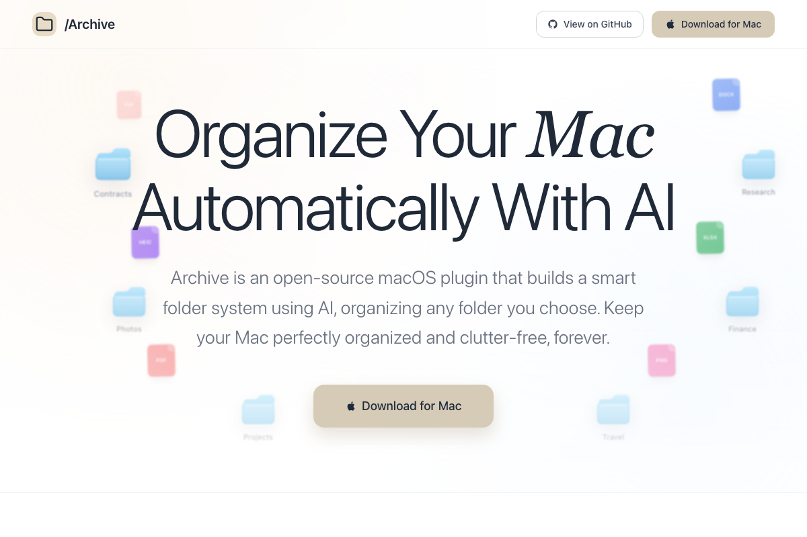

[](https://archive-plugin.vercel.app/)

# Archive Plugin

[](https://github.com/daniel-trachtenberg/archive-plugin/releases/latest)
[](https://github.com/daniel-trachtenberg/archive-plugin/releases/latest/download/Archive.dmg)
[](https://archive-plugin.vercel.app/)

Archive Plugin is a macOS menu bar app plus local Python backend for AI-powered file organization and semantic search.

It watches an input folder, embeds and categorizes files, stores searchable vectors in ChromaDB, and helps you find files quickly from a Spotlight-style search window.

## Download

- Direct download (latest macOS DMG): `https://github.com/daniel-trachtenberg/archive-plugin/releases/latest/download/Archive.dmg`
- Latest release page: `https://github.com/daniel-trachtenberg/archive-plugin/releases/latest`
- Live landing page: `https://archive-plugin.vercel.app/`

> Note: the current public build is unsigned and not notarized. macOS may require right-click `Open` and/or `System Settings > Privacy & Security > Open Anyway` on first launch.

## Product scope

- Automatic file organization into your archive directory
- Semantic search across archived files
- Drag-and-drop/manual upload flow
- Cloud and local LLM support
- Secure API key storage (encrypted and/or Keychain-backed)
- First-run onboarding flow
- Customizable keyboard shortcuts
- Time-filtered move logs for debugging
- In-app Sparkle auto-updater

## Repository structure

- `ArchiveMac/` macOS SwiftUI app
- `backend/` FastAPI backend, file watchers, ChromaDB integration
- `docs/` project documentation

## Supported file types

- Documents: `.pdf`, `.txt`, `.md`, `.rtf`, `.doc`, `.docx`, `.ppt`, `.pptx`, `.xls`, `.xlsx`, `.csv`
- Images: `.jpg`, `.jpeg`, `.png`, `.gif`, `.webp`, `.heic`, `.heif`

## Quick start

1. Clone repository.

```bash
git clone https://github.com/daniel-trachtenberg/archive-plugin.git
cd archive-plugin
```

2. Set up backend.

```bash
cd backend
python3 -m venv .venv
source .venv/bin/activate
pip install -r requirements.txt
cp .env.example .env
python main.py
```

3. Run the macOS app.

```bash
cd ../ArchiveMac
open ArchiveMac.xcodeproj
```

Build and run `ArchiveMac` from Xcode.

## First launch and onboarding

On first launch, onboarding walks users through:

- What the product does
- Choosing `Input` and `Archive` folders
- Setting keyboard shortcuts

Users can reopen onboarding any time from the menu bar dropdown via `Onboarding`.

## Keyboard shortcuts

Default shortcuts:

- Search: `Option + Space`
- Upload: `Option + U`
- Settings: `Command + ,`

Users can customize shortcuts in:

- Onboarding
- Settings > Shortcuts

## LLM configuration

Configure from Settings > AI.

Cloud mode:

- Providers: OpenAI, Anthropic
- Select model from list or enter custom model
- Add one API key per provider in UI

Local mode:

- Provider uses local endpoint (Ollama-compatible)
- Default base URL: `http://localhost:11434`
- Enter model id manually

## Security model for API keys

- Plaintext provider keys are migrated to encrypted storage
- Encrypted values are persisted in backend `.env` (`*_API_KEY_ENC`)
- Master key is loaded from `ARCHIVE_MASTER_KEY`, system keyring, or local protected key file
- Keychain fallback is used when encryption is unavailable

## Update checks and versioning

The app uses Sparkle for in-app updates from the menu and Settings.

- Current app version/build is displayed in Settings > About
- Sparkle reads `appcast.xml` (hosted from this repo) and downloads/install updates in-app
- Update payloads are EdDSA signed with Sparkle keys (`SUPublicEDKey` in app Info.plist)

Sparkle feed URL:

- `https://raw.githubusercontent.com/daniel-trachtenberg/archive-plugin/main/appcast.xml`

See `docs/RELEASE.md` for release process.

## API reference

See `docs/API.md`.

## Troubleshooting

See `docs/TROUBLESHOOTING.md`.

## Deployment

See `docs/DEPLOYMENT.md` for packaging/signing/notarization and direct-download release workflow.

## Notes for publishing

Before publishing a release:

- Bump Xcode app version/build (`MARKETING_VERSION`, `CURRENT_PROJECT_VERSION`)
- Create and publish a GitHub release tag (example `v1.0.0`)
- Run `./scripts/release_macos.sh` and commit updated `appcast.xml`
- Verify `Check for Updates` offers the new build
